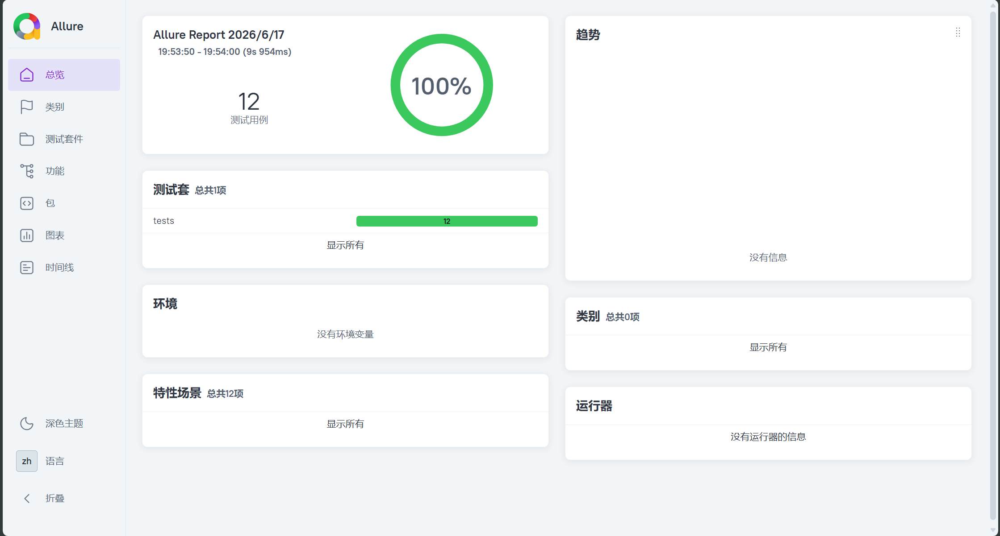

# SauceDemo 自动化测试项目

用 Playwright + pytest 写的一个自动化测试练习项目，测试对象是 SauceDemo（一个公开的电商演示网站：https://www.saucedemo.com）。覆盖了登录、购物车、结算这几个核心流程。

## 用了什么

- Playwright
- Python + pytest
- Allure
- Page Object Model

## 目录结构

```
playwright-demo/
├── pages/          # 页面操作封装
│   ├── login_page.py
│   ├── cart_page.py
│   └── checkout_page.py
├── tests/          # 测试用例
│   ├── test_login.py
│   └── test_cart.py
├── conftest.py     # pytest 配置
└── reports/        # 测试报告
```

## 用例情况

一共 12 条用例：

- 登录相关 5 条：登录成功、密码错误、用户名为空、密码为空、账号被锁
- 购物车相关 3 条：加购后数量变化、购物车展示商品、移除商品
- 结算相关 4 条：结算成功、姓名/姓氏/邮编为空的报错提示

异常场景用 `pytest.mark.parametrize` 写成参数化用例，一个函数测多组数据。

## 怎么跑起来

```bash
pip install playwright pytest pytest-playwright allure-pytest
playwright install chromium

pytest tests/ -v
```

Allure 报告：

```bash
pytest tests/ -v --alluredir=reports/allure-results
allure serve reports/allure-results
```
