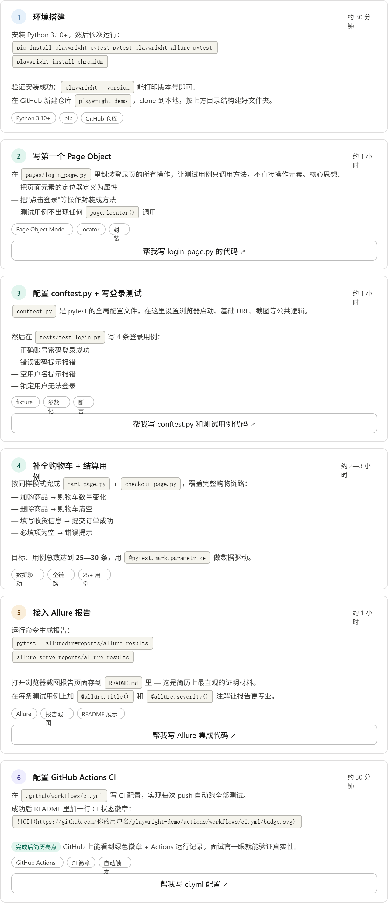

playwright-demo/
pages/
Page Object 层
login_page.py
cart_page.py
checkout_page.py
tests/
测试用例层
test_login.py
test_cart.py
test_checkout.py
data/
测试数据层
users.json
products.json
配置 & CI 文件
conftest.py
playwright.config.py
.github/workflows/ci.yml
三层架构
Page Object — 封装页面操作
Tests — 编写业务用例
Data — 参数化测试数据
核心工具栈
Playwright — 浏览器自动化
pytest — 用例组织 & 运行
Allure — 测试报告
GitHub Actions — CI 触发
练习目标站点
saucedemo.com（免费公开）
